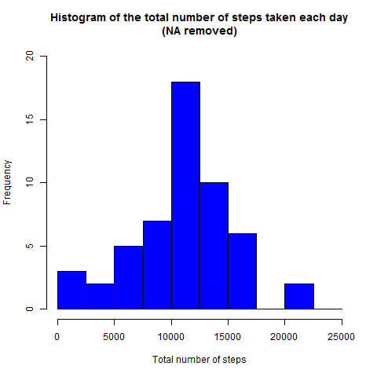
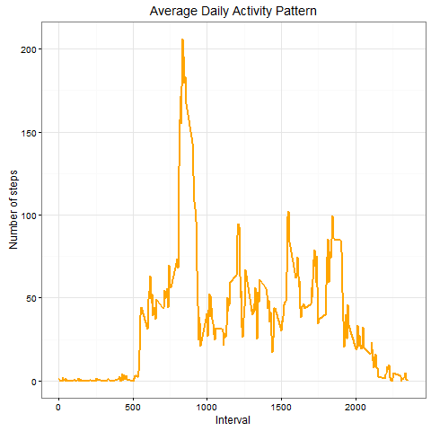
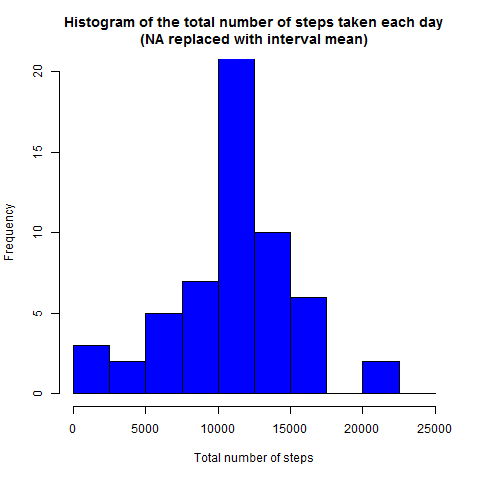
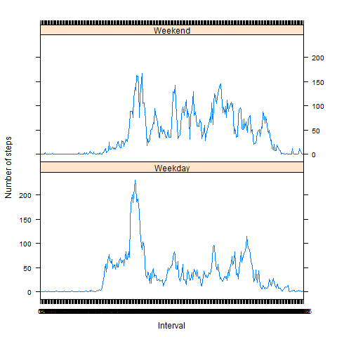

## 1. Loading and preprocessing the data

##### 1.1	Load the data (i.e. read.csv())
Clear the workspace and load the raw activity data.

```r
rm(list=ls())

rdata <- read.csv('activity.csv', header = TRUE, sep = ",",
                    colClasses=c("numeric", "character", "numeric"))
``` 

#####  1.2	Process/transform the data into a format suitable for analysis
Convert the **date** field to Date class and **interval** field to Factor class
  
```r
  # Convert the date field to Date class
  rdata$date <- as.Date(rdata$date, format = "%Y-%m-%d")

  # Convert the interval field to Factor class.
  rdata$interval <- as.factor(rdata$interval)
```  
  

## 2. What is mean total number of steps taken per day?
For this part of the assignment we can ignore the missing values in the dataset.
  
##### 2.1	Calculate the total number of steps taken per day
Calculate the total steps per day.
  
```r
  steps_per_day <- aggregate(steps ~ date, rdata, sum)  
  
  #> str(steps_per_day)
  #'data.frame':	53 obs. of  2 variables:
  #  $ date : Date, format: "2012-10-02" "2012-10-03" "2012-10-04" ...
  #  $ steps: num  126 11352 12116 13294 15420 ...
```  
The *aggregate* function tells that there are **53 days**.


##### 2.2	Make a histogram of the total number of steps taken each day
Compute the histogram of the total number of steps each day.

```r
  # 1 Open a graphics device.
  png(filename="figure/plot1.png")
  
  # 2 Create the plot
  hist(steps_per_day$steps, 
       breaks=seq(from=0, to=25000, by=2500),
       col="blue", 
       xlab="Total number of steps", 
       ylim=c(0, 20), 
       main="Histogram of the total number of steps taken each day\n(NA removed)")

  # 3 Close the graphics device        
  dev.off()
```    

  
##### 2.2 Calculate and report the mean and median total number of steps taken per day
Calculate the **mean** and **median** and print them at video.

```r
    #The mean and median are computed like
    steps_mean   <- mean(steps_per_day$steps, na.rm=TRUE)
    steps_median <- median(steps_per_day$steps, na.rm=TRUE)
    
    print(paste("The mean steps per day is: ", steps_mean   ))
    print(paste("The median steps per day is: ", steps_median))
    
    # [1] "The mean steps per day is:  10766.1886792453"
    # [1] "The median steps per day is:  10765"
```
The **mean** steps per day is:    10766.19.
The **median** steps per day is:  10765.
  

## 3. What is the average daily activity pattern?

##### 3.1 Calculate the mean value of steps for each interval over 58 days
Calculate the aggregation of steps by intervals of 5-minutes and convert the intervals as integers and save them in a data frame called *steps_per_interval*.

```r
    steps_per_interval <- aggregate(rdata$steps, 
                                    by = list(interval = rdata$interval),
                                    FUN=mean, na.rm=TRUE)
    
    # convert to integers (this helps in plotting)
    steps_per_interval$interval <- 
      as.integer(levels(steps_per_interval$interval)[steps_per_interval$interval])
    
    # Rename columns 
    colnames(steps_per_interval) <- c("interval", "steps")
```
    
##### 3.2 Plot the aggregation of steps by intervals of 5-minutes
Make the plot with the time series of the average number of steps taken (averaged across all days) versus the 5-minute intervals
    
```r
    # 1 Open a graphics device.
    library(ggplot2)        # Necessary for ggplot
    png(filename="figure/plot2.png")
    
    # 2 Create the plot
    print(ggplot(steps_per_interval, aes(x=interval, y=steps)) +   
            geom_line(color="orange", size=1) +  
            labs(title="Average Daily Activity Pattern", x="Interval", y="Number of steps") +  
            theme_bw())
    
    # Note: Lattice functions such as xyplot() create a graph object, but do not display it (the same is true of ggplot2 graphics, and Trellis graphics in S-PLUS).
    # The print() method for the graph object produces the actual display.
    # When you use these functions interactively at the command line, the result is automatically printed, but in source() or inside your own functions you will need an explicit print() statement. 
        
    
    # 3 Close the graphics device        
    dev.off()
```




    
##### 3.3 Calculate the 5-minute interval with the containing the maximum number of steps:

```r
    max_interval <- steps_per_interval[which.max(  
        steps_per_interval$steps),]

    print(paste("The ", 
                max_interval$interval, 
                "th interval has maximum ",
                max_interval$steps," steps."))
    
```
The  **835th** interval has maximum **206.17** steps."

## 4. Imputing missing values
    
##### 4.1 Total number of missing values
The total number of missing values in steps can be calculated using is.na() method to check whether the value is mising or not and then summing the logical vector.

```r
    missing_vals <- sum(is.na(rdata$steps))
    
    print(paste("The total number of missing values are ", 
                missing_vals))
```    
The total number of missing values are **2304**.   
    
##### 4.2. Devise a strategy for filling in all of the missing values in the dataset.
We use mean mean value for that 5-minute interval to replace the NA values.
    
```r

    fillNA <- numeric()
    
    for (i in 1:nrow(rdata)) {
      obs <- rdata[i, ]
      if (is.na(obs$steps)) {
        steps <- subset(steps_per_interval, interval == obs$interval)$steps
      } else {
        steps <- obs$steps
      }
      fillNA <- c(fillNA, steps)
    }
```    
    
        
##### 4.3. Create a new dataset that is equal to the original dataset but with the missing data filled in.

```r
    rdataNoNA <- rdata
    rdataNoNA$steps <- fillNA
```    
    
##### 4.4.	Make a histogram of the total number of steps taken each day and Calculate and report the mean and median total number of steps taken per day. Do these values differ from the estimates from the first part of the assignment? What is the impact of imputing missing data on the estimates of the total daily number of steps?

```r
    # Calculate the total steps per day.
    steps_per_day_No_NA <- aggregate(steps ~ date, rdataNoNA, sum)      
    
    # 1 Open a graphics device.
    png(filename="figure/plot3.png")
    
    # 2 Create the plot
    # Compute the histogram of the total number of steps each day
    hist(steps_per_day_No_NA$steps, 
         breaks=seq(from=0, to=25000, by=2500),
         col="blue", 
         xlab="Total number of steps", 
         ylim=c(0, 20), 
         main="Histogram of the total number of steps taken each day\n(NA replaced with interval mean)")
    
    # 3 Close the graphics device        
    dev.off()
```




The strategy adopted for filling in all of the missing values in the dataset does not change the values estimated from the first part of the assignment.


## 5. Are there differences in activity patterns between weekdays and weekends?
Add to the **rdataNoNA** data.frame the new variable **daylevel**.
This variable can be equal to: *Weekend* or *Weekday*.


```r
    # Create a new factor variable in the dataset with two levels:
    # "weekday" and "weekend" indicating whether a given date is a weekday or weekend day.
    
    # The wday component of a POSIXlt object is the numeric weekday (0-6 starting on Sunday).
    # The wday component of a POSIXlt object is the numeric weekday (0-6 starting on Sunday).
    # as.POSIXlt(df$date)$wday
    ## [1] 3 3 4

    day <- as.POSIXlt(rdataNoNA$date)$wday
    daylevel <- vector()
    for (i in 1:nrow(rdataNoNA)) {
      if (day[i] == 0 || day[i]== 6 ) {        
        daylevel[i] <- "Weekend"
      } else {
        daylevel[i] <- "Weekday"
      }
    }
    
    
    rdataNoNA$daylevel <- daylevel
    rdataNoNA$daylevel <- factor(rdataNoNA$daylevel)
    
    stepsByDay <- aggregate(steps ~ interval + daylevel, data=rdataNoNA, mean)
    names(stepsByDay) <- c("interval", "daylevel", "steps")
    
    library(lattice)        # Necessary for xyplot() function
    # 1 Open a graphics device.
    png(filename="figure/plot4.png")    

    # Make a panel plot containing a time series plot (i.e. type = "l") of the 5-minute interval (x-axis) and the average number of steps taken, averaged across all weekday days or weekend days (y-axis). The plot should look something like the following, which was creating using simulated data:          
    print(xyplot(steps ~ interval | daylevel, 
           stepsByDay, type = "l", 
           layout = c(1, 2), 
           xlab = "Interval", 
           ylab = "Number of steps"))
    
    # 3 Close the graphics device        
    dev.off()
 
```  




We can see that in the weekend people begin to walk later than in the weekdays but, at the same time, in the weekend people walk constantly during the day while in the weekdays they walk less.


